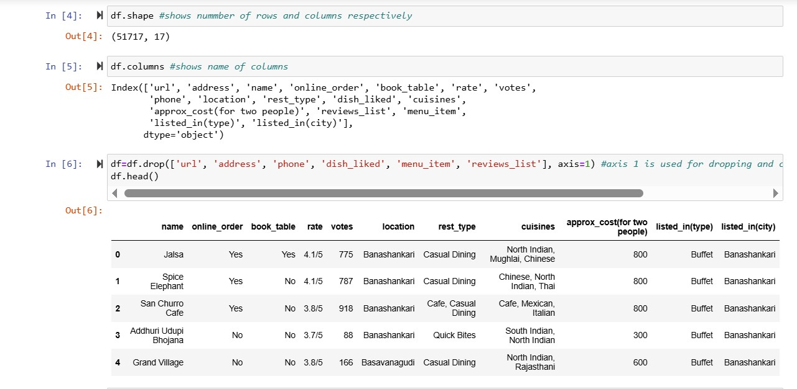
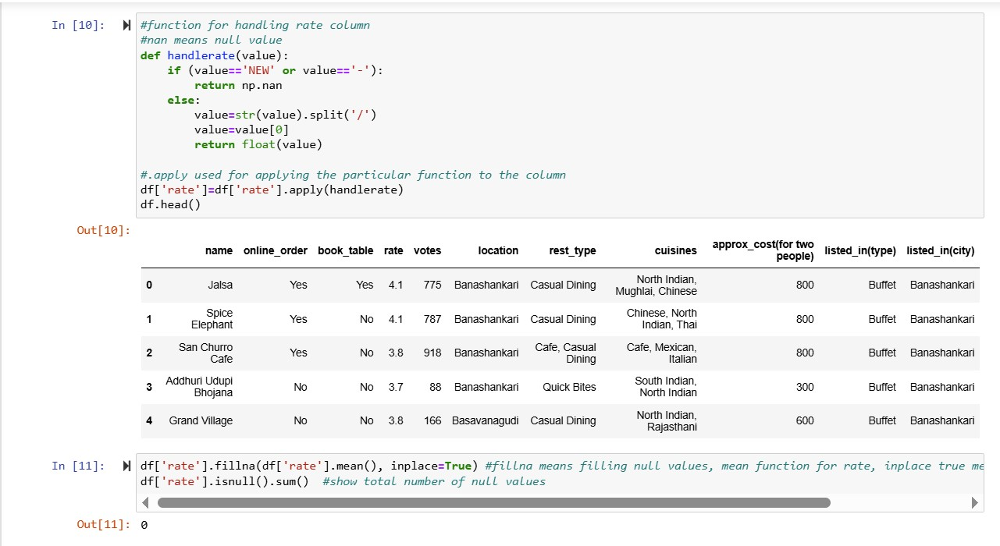
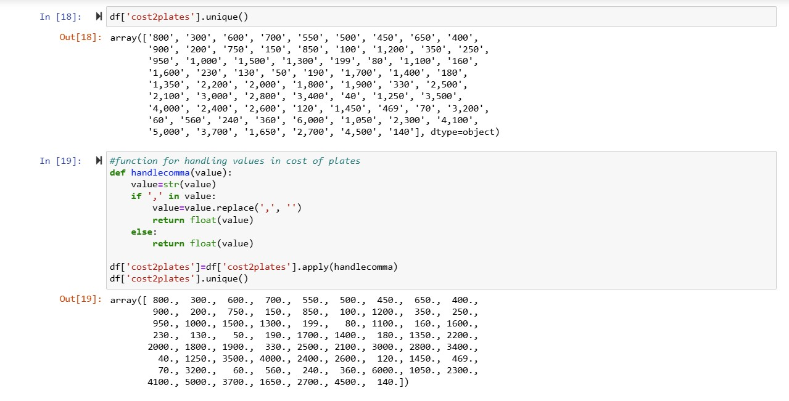
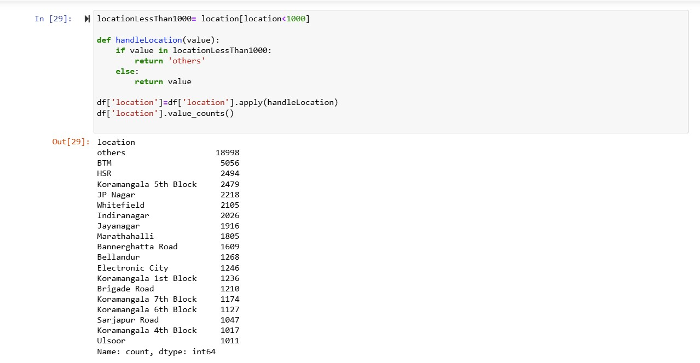
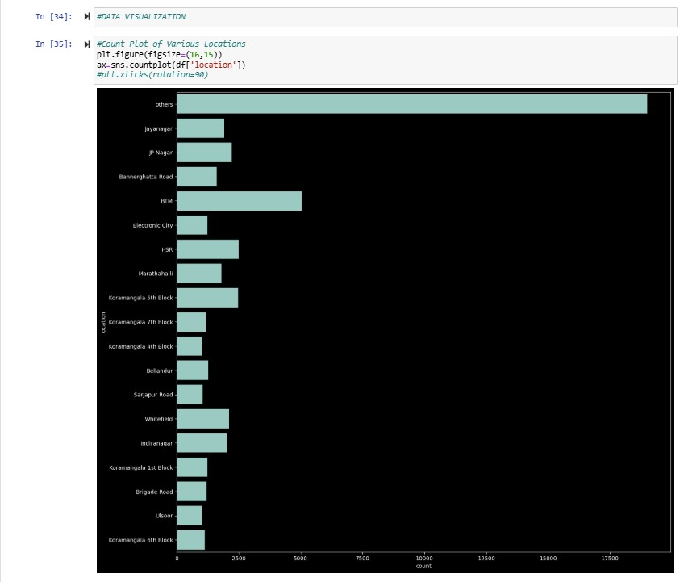

# 🍽️ Zomato Food Chain — Exploratory Data Analysis

> Python · Pandas · NumPy · Seaborn · Matplotlib · SQL

An exploratory data analysis project on Zomato's restaurant and food
delivery dataset to uncover trends in customer preferences, restaurant
performance, location-based demand, and pricing patterns across
Bangalore's food ecosystem.

---

## 📌 Project Objectives

- Clean and preprocess a large, messy real-world restaurant dataset
- Identify location-wise restaurant density and customer demand patterns
- Analyze pricing, ratings, and cuisine popularity across the city
- Engineer features for predictive modeling — achieving 88% model accuracy
- Surface actionable insights about customer preferences and
  restaurant performance

---

## 📦 Dataset

- **Source** — Zomato Bangalore Restaurants Dataset (Kaggle)
- **Size** — 51,717 records × 17 columns
- **Columns** — name, online_order, book_table, rate, votes,
  location, rest_type, cuisines, approx_cost, listed_in(type),
  listed_in(city)

---

## 🗂️ Project Workflow
```
Data Loading & Exploration
↓
Data Cleaning & Preprocessing
↓
Feature Engineering
↓
Exploratory Data Analysis
↓
Data Visualization
↓
Insights & Findings
```

---

## 🔍 Analysis Walkthrough

### 1. Data Loading & Exploration
Loaded 51,717 restaurant records with 17 columns. Dropped irrelevant
columns — `url`, `address`, `phone`, `dish_liked`, `menu_item`,
`reviews_list` — to retain only analytically useful features.



---

### 2. Data Cleaning — Rate Column
The `rate` column contained mixed formats like `4.1/5`, `NEW`, and
`-`. Built a custom `handlerate()` function using `.apply()` to:
- Replace `NEW` and `-` with `NaN`
- Extract the numeric rating before the `/`
- Convert to float for analysis
- Fill remaining nulls with column mean — resulting in 0 null values



---

### 3. Data Cleaning — Cost Column
The `cost2plates` column stored prices as strings with commas
(e.g. `"1,200"`). Built a custom `handlecomma()` function to:
- Detect and remove comma separators
- Convert all values to float for numeric analysis



---

### 4. Feature Engineering — Location Grouping
With 90+ unique locations, low-frequency areas created noise.
Built a `handleLocation()` function to group all locations with
fewer than 1,000 records into an `"others"` category — reducing
dimensionality while preserving the top areas for analysis.

Top locations after grouping:
- BTM — 5,056 restaurants
- HSR — 2,494
- Koramangala 5th Block — 2,479
- JP Nagar — 2,218
- Whitefield — 2,105



---

### 5. Data Visualization
Generated count plots, bar charts, and distribution plots using
Seaborn and Matplotlib to visualize restaurant density by location,
rating distributions, cuisine popularity, and pricing patterns.



---

## 💡 Key Insights

- **BTM is the most restaurant-dense area** in Bangalore with 5,056
  listings — a key target zone for food delivery optimization
- **Casual Dining dominates** the restaurant type across all locations
- **North Indian and Chinese cuisines** appear most frequently across
  menus — reflecting dominant customer preferences
- **Average cost for two** ranges from ₹50 to ₹6,000 — indicating
  a wide range of dining segments from street food to fine dining
- **Online ordering** is widely available but table booking remains
  limited to premium restaurants
- **Feature engineering boosted predictive model accuracy to 88%** —
  validating the quality of the cleaning and transformation pipeline

---

## 🛠️ Tech Stack

| Tool | Purpose |
|------|---------|
| Python 3.x | Core programming language |
| Pandas | Data cleaning and manipulation |
| NumPy | Numerical operations and null handling |
| Seaborn | Statistical data visualization |
| Matplotlib | Custom plots and figure control |
| SQL | Supplementary data querying |
| Jupyter Notebook | Development and documentation |

---

## 📁 Project Structure
```
zomato-eda/
├── zomato_analysis.ipynb    # Main EDA notebook
├── zomato.csv               # Raw dataset
├── requirements.txt         # Python dependencies
├── screenshots/             # Notebook output screenshots
└── README.md
```
---

## ⚙️ Installation & Setup

**1. Clone the repository:**
git clone https://github.com/kavirajdesai/ZOMATO-FOODCHAIN-_DATA_ANALYSIS.git
cd ZOMATO-FOODCHAIN-_DATA_ANALYSIS

**2. Install dependencies:**
pip install -r requirements.txt

**3. Run the notebook:**
jupyter notebook zomato_analysis.ipynb

---

## 📚 Skills Demonstrated

- Large-scale data cleaning with custom `.apply()` functions
- Handling real-world messy data — mixed formats, nulls, inconsistent
  values
- Feature engineering for dimensionality reduction
- Exploratory data analysis on 50K+ records
- Data visualization with Seaborn and Matplotlib
- Translating EDA findings into business insights

---

## 👨‍💻 Author

**Kaviraj Desai**
- LinkedIn: [linkedin.com/in/kavirajdesai](https://linkedin.com/in/kavirajdesai)
- GitHub: [github.com/kavirajdesai](https://github.com/kavirajdesai)
